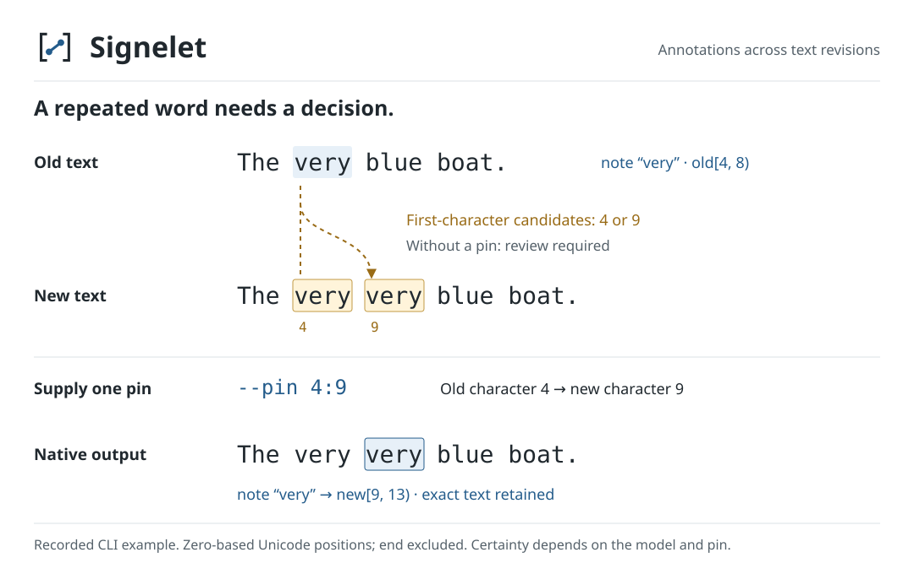

# Signelet

Transfer text notes between edited documents only when every best alignment agrees on their destination. Signelet is an optional policy for native [STAM](https://annotation.github.io/stam) annotation stores. STAM handles resources, note data, transposition and provenance; Signelet decides which selected notes can safely use that machinery under a fixed edit model.



Ambiguous, deleted or changed notes stay in the output with a review status. Budget exhaustion is `unknown`. No omitted span is counted as resolved.

## Install

Python 3.12 or newer is required. Install the source directory or a built wheel:

```sh
python -m pip install .
# or: python -m pip install signelet-0.1.0-py3-none-any.whl
signelet --version
```

Installation also downloads the required `stam==0.12.1` dependency unless it is already available. Runtime is local and makes no network requests. Signelet's original code is MIT; STAM is GPL-3.0-only and is neither bundled nor relicensed. See [dependency and lineage notes](THIRD-PARTY-NOTICES.md).

## Try the example

The example is in the source archive, not installed into your working directory by a wheel. If you installed only the wheel, unpack the matching source archive and enter it first:

```sh
tar -xzf signelet-0.1.0.tar.gz
cd signelet-0.1.0
```

The shipped native STAM store contains original text `The very blue boat.`, edited text `The very very blue boat.`, and two self-authored notes. Run it into a new directory:

```sh
signelet examples/repeated.stam.json --source original --target edited \
  --note very --note boat --output result-review
```

Exit code 1 is expected: `boat` transfers to `[19,23)`; `very` stays unresolved. Inspect `result-review/review-ledger.json`. Its bounded candidate hints show that the source `v` at offset 4 can map to target 4 or 9. Choose one equal character, then recompute from the original input:

```sh
signelet examples/repeated.stam.json --source original --target edited \
  --note very --note boat --pin 4:9 --output result-pinned
```

This returns 0. The `very` note transfers to `[9,13)`. Pins encode your assumption; certainty is conditional on the pins and model. First/last candidate hints do not guarantee those choices coexist on a full path.

A completed run (exit 0 or 1) produces `store.stam.json` and `review-ledger.json`. Originals remain in the store. Ledger rows identify transferred notes and native provenance outputs or explain refusal. Exit codes: **0** all requested notes transferred; **1** valid result with review, unknown or unsupported notes; **2** input/runtime error. Existing output directories are refused, including directories created during computation. Input files are unchanged.

## Use an existing STAM store

Supply an ordinary inline native STAM JSON store containing both original and edited text resources, then name their IDs and the note IDs to transfer. No new annotation input schema is needed. Resource text must be inline; external `@include` files are refused before native loading.

Reopen the result through STAM:

```python
import json
from pathlib import Path
from stam import AnnotationStore

ledger = json.loads(Path("result-pinned/review-ledger.json").read_text())
row = next(row for row in ledger["rows"] if row["id"] == "very")
store = AnnotationStore(file="result-pinned/store.stam.json")
note = store.annotation(row["output_note_id"])
for selection in note.textselections():
    print(selection.resource().id(), selection.begin(), selection.end(), selection.text())
```

For an already-loaded store, `from signelet import integrate` exposes `integrate(store, source_id, target_id, note_ids, pins=(), max_band=64, cell_limit=2_000_000)`. It returns an isolated native store and ledger, leaving the caller's store untouched. Safe loading of that original store is the API caller's responsibility.

## What agreement means

An edit alignment assigns original characters to edited characters or deletions. Signelet considers every global alignment with minimum unit edit cost: matching costs 0; insertion, deletion or substitution costs 1. A certified diagonal band covers every optimal path, not just one chosen path. A note transfers only when every covered character has one agreed destination, the destinations are consecutive, and the exact original text survives.

This is separate from STAM's configurable local/global scoring. Agreement under this model is not semantic truth or a novelty claim. Offsets are **Unicode code points**, not browser UTF-16 units or visible grapheme clusters. Text is not normalized; composed and decomposed characters differ.

## Limits

Only one direct, nonempty, contiguous native `TextSelector` on the stated original resource is supported. Compound or higher-order selectors remain intact and are marked unsupported. Notes spanning an inserted gap are refused. Native data and references are checked after transposition; raw JSON spelling is not a lossless interchange promise.

Inputs are bounded: 4 MiB serialized store, 5,000 selected notes, 100,000 code points / 256 KiB UTF-8 per resource, and 100,000 total selected character coverage. Alignment allows 2,000,000 cumulative alignment-grid cells and band 64 per segment between pins. `--cell-limit` and `--max-band` can lower those limits. Serialization occurs before the API store-size check, so this is not a hard memory ceiling. Large or heavily changed texts may require review because the budget is exhausted.

## Validation

Tests use actual STAM, native store save/reopen, notes/data/provenance, Unicode selections, ambiguity, pins and refusals. Run `python -m unittest discover -s tests -v` after installation. CI is configured for Python 3.12 and 3.14 with STAM 0.12.1; the same native cases passed locally on macOS arm64 under Python 3.12.14 and 3.14.7.

Earlier private feasibility checks on macOS arm64, Python 3.12.14 and STAM 0.11.1 used public-domain Alice Chapter I (11,775 code points) and 2,195 self-authored synthetic word notes. A heading insertion transferred all notes; changing the first `Alice` to `Alicia` transferred 2,194 and retained one for review. These controlled cases do not establish user demand or universal performance. The chapter is not bundled; [fixture reconstruction and validation scope](docs/validation.md) give the source, hash, selection method and reuse terms.
